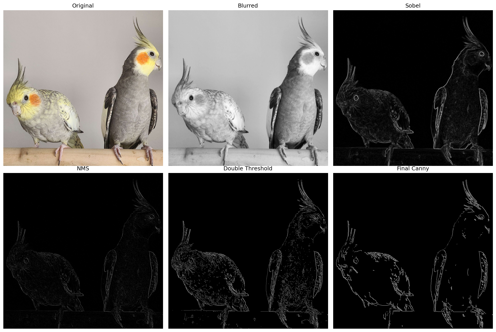
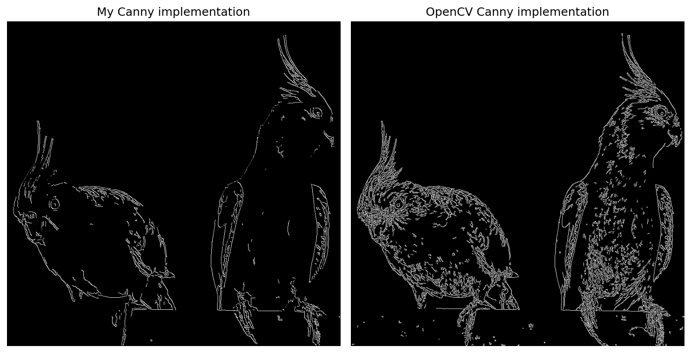
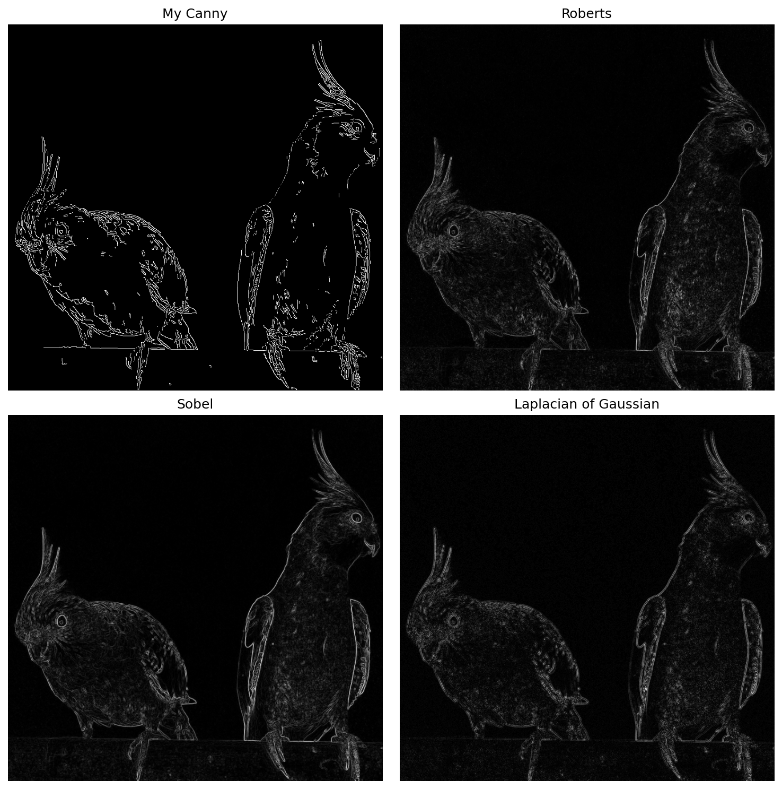

# Canny Edge Detector
Canny Edge Detector implementation for AI fundamentals project.
Built from scratch in Python using NumPy, without relying on any built-in edge detection functions.

The pipeline implements five steps for edge detection: Gaussian blur, Sobel gradients, Non-Maximum Suppression, Double Thresholding, and Hysteresis.

This repository includes example images to test the program on and their corresponding output images, but you can also use your own images!

This repository also includes the written report about the project.

## Dependencies
- Python 3.x
- NumPy
- OpenCV
- Matplotlib

Install dependencies with:
```bash
pip3 install numpy opencv-python matplotlib
```

## Installation
```bash
git clone https://github.com/AdriOnGit/canny-edge-detector.git
```

## Usage
```bash
cd canny-edge-detector
python3 main.py -i  [-k ] [-s ] [-l ] [-u ]
```

### Arguments
| Argument | Default | Description |
|----------|---------|-------------|
| `-h`, `--help` | - | Show help usage message |
| `-i`, `--image` | required | Path to input image |
| `-k`, `--kernel` | 5 | Gaussian kernel size |
| `-s`, `--sigma` | 1.0 | Gaussian sigma |
| `-l`, `--low` | 0.1 | Low threshold ratio |
| `-u`, `--high` | 0.3 | High threshold ratio |

## Example Output
The following images show the program output: a full pipeline breakdown showing the image after each step, a comparison with OpenCV's Canny implementation, and a comparison with other edge detectors: Roberts, Sobel, and Laplacian of Gaussian.



